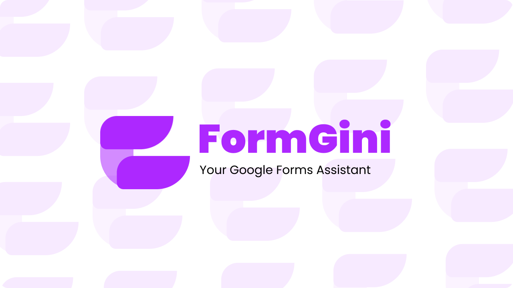

FormGini is a Chrome extension designed to revolutionize your form-filling experience. Say hello to a hassle-free way of generating responses for Google Forms using the power of GPT-based chat.

  
  

---

## 👨‍💻 Installation
Currently FormGini is not available on Chrome Web Extension. First download this repo zip and then unzip it, enable chrome extension developer mode and then click "Load Unpacked" and select the folder. That's it.

## ✍️ Contributing
We welcome contributions! If you want to contribute to FormGini, follow these steps:
- Fork the repository.
- Create a new branch for your feature: git checkout -b feature-your-feature.
- Commit your changes: git commit -m 'Add a new feature'.
- Push to the branch: git push origin feature-your-feature.
- Submit a pull request.

## 🌟 Spread the word!
If you want to say thank you and/or support active development of the Well app:
- Add a GitHub Star to the project!
- Tweet about the project on your Twitter or Instagram!, Tag @ktshacx and/or #formgini
- Or you may Buy Me a Coffee

---
